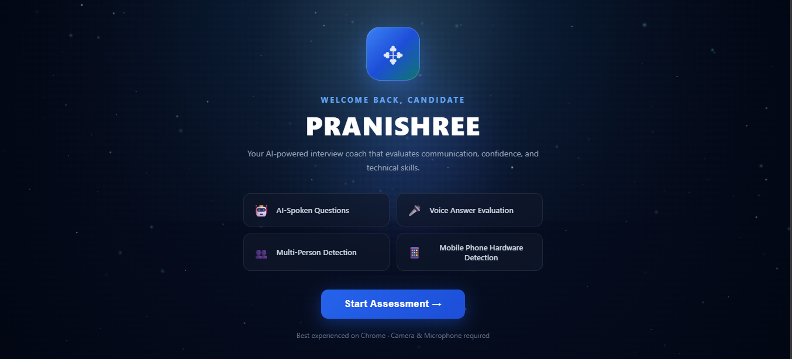
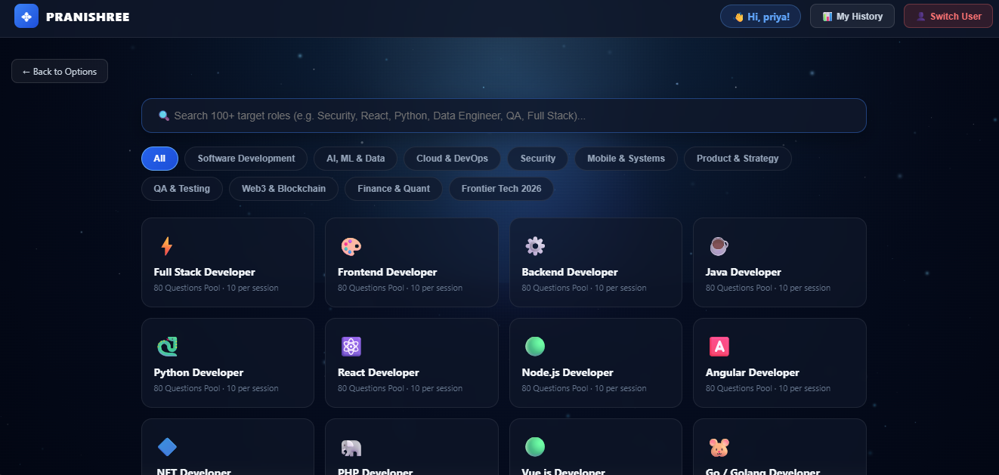
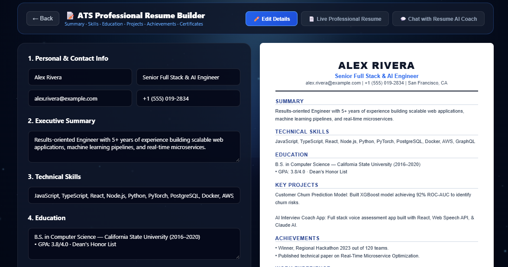
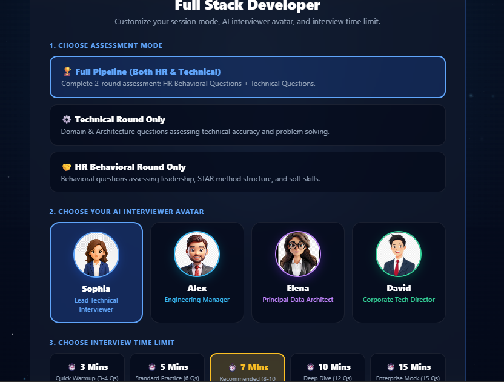
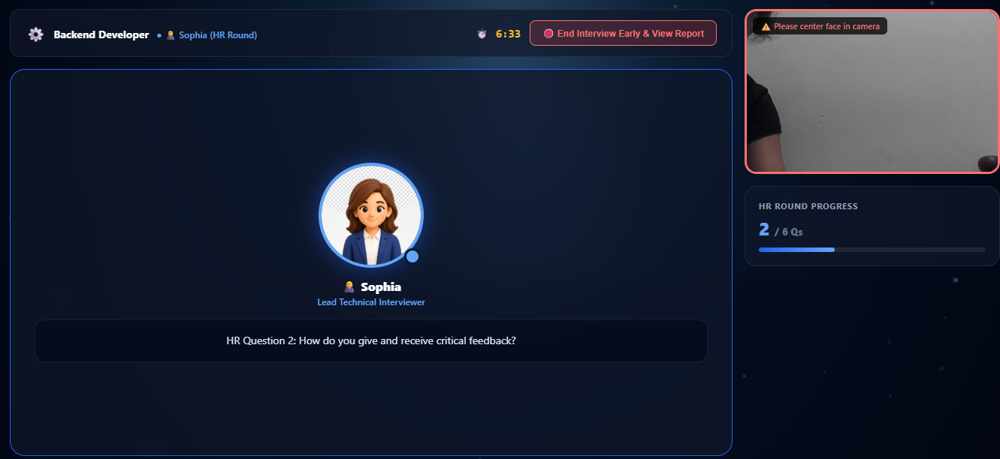
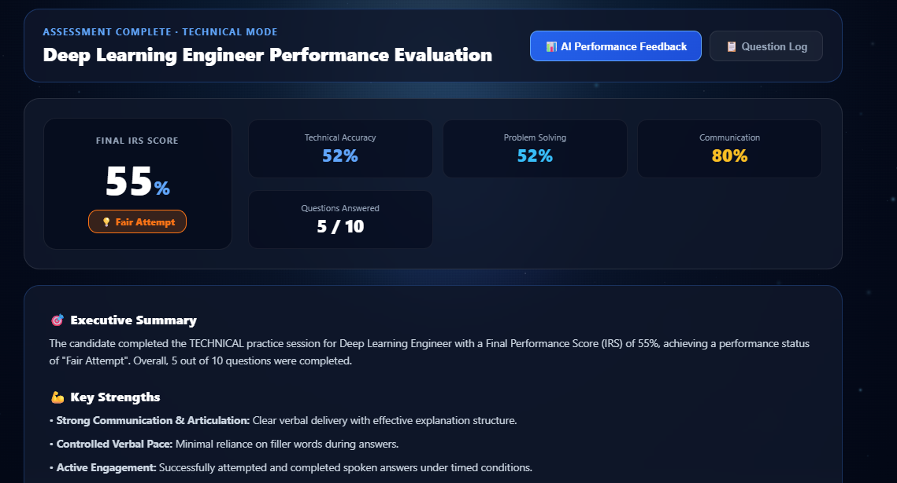
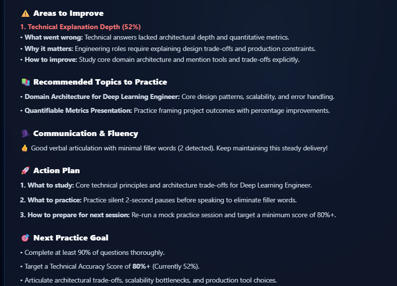
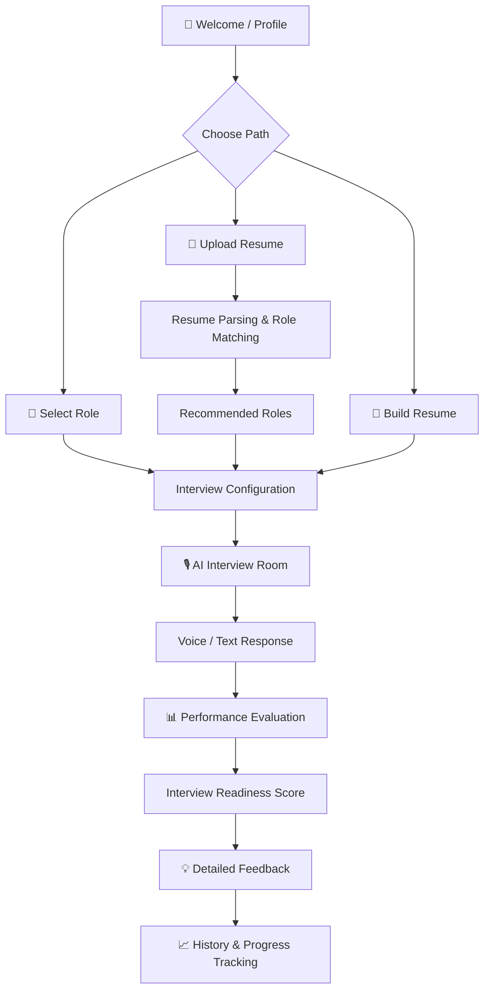

# 🚀 Pranishree AI Interview Platform

### AI-Powered Interview Preparation, Resume Intelligence & Candidate Readiness Platform

Pranishree is an interactive interview preparation platform that helps candidates **discover suitable career roles, build ATS-friendly resumes, practice technical and behavioral interviews, experience voice-based interviewing, and analyze their interview performance**.

The platform brings the complete preparation journey into one workflow:

> **Resume → Role Matching → Interview → Evaluation → Feedback → Progress**

---
# 🎯 Pranishree AI Interview Platform

> AI-Powered Mock Interview, Proctoring & Resume Matching Platform

🚀 **[Live Demo](https://pranishree-ai-interview-platform.vercel.app/)**   |   💻 **[GitHub Repository](https://github.com/PriyankaMurthy39/Pranishree-AI-Interview-Platform)**

> 💡 Best experienced on desktop with microphone and camera permissions enabled.

---


## 📸 Screenshots

### 🏠 Home Page



### 📄 Resume Analyzer


### 🎯 Role Selection



### 📝 Resume Builder



### 🎤 AI Interview



### 🎥 Proctored Interview



### 📊 Interview Feedback



### 📈 Interview Results & Analytics




---

## ✨ Why Pranishree?

Traditional mock interviews often focus only on asking questions.

Pranishree provides a complete preparation workflow by combining:

* 🤖 Resume-to-role matching
* 📝 ATS resume building
* 🧠 Resume improvement guidance
* 🎙️ Voice-based interviewing
* 💻 Technical interview practice
* 👥 Behavioral / HR interviews
* 🛡️ Browser-based proctoring
* 📊 Performance analytics
* 💡 Question-level feedback
* 📈 Interview history and progress tracking

---

# 🎯 Key Features

## 🤖 1. Resume Intelligence & Role Matching

Candidates can upload their resume or paste their resume content to discover suitable career paths.

### Supported formats

* PDF
* DOC
* DOCX
* TXT
* Direct text input

### Matching factors

The role matching engine considers:

* Job title relevance
* Domain-specific skills
* Technical stack
* Role-specific keywords
* Skill coverage
* Category/domain mismatch

The system ranks suitable career tracks based on the candidate's resume profile.

### Example roles

`AI Engineer` · `Machine Learning Engineer` · `Data Scientist` · `Data Engineer` · `Full-Stack Developer` · `Cloud Engineer` · `DevOps Engineer` · `Cybersecurity Engineer` · `Database Engineer` · `Product Manager` · `UI/UX Designer`

---

# 📝 2. ATS Resume Builder

Candidates can create a structured, ATS-friendly resume directly inside the platform.

### Resume sections

* Contact information
* Professional summary
* Education
* Work experience
* Projects
* Technical skills
* Certifications

The builder provides a live resume preview and print-ready formatting.

---

# 🧠 3. Resume Coach

The Resume Coach helps candidates improve the quality and impact of their resume.

It focuses on:

* Stronger action verbs
* Better professional summaries
* Quantifiable achievements
* Clear project descriptions
* Impact-oriented wording

The goal is to help candidates communicate **what they built, how they built it, and what impact it had**.

---

# 🎙️ 4. Voice-Based Interview

Pranishree provides an interactive interview experience using browser speech technologies.

### Features

* 🔊 Text-to-speech questions
* 🎤 Speech-to-text answer capture
* 📝 Live transcript
* ✏️ Editable transcribed responses
* ⌨️ Manual text response support

The platform uses browser-native speech capabilities to create a hands-free interview experience.

---

# 🎯 5. Multiple Interview Modes

Candidates can select an interview mode based on their preparation requirements.

| Mode               | Focus                               |
| ------------------ | ----------------------------------- |
| 🧩 Full Pipeline   | HR + Technical                      |
| 👥 HR Round        | Behavioral & Situational            |
| 💻 Technical Round | Domain-specific Technical Questions |

This allows candidates to practice individual interview stages or simulate a complete interview process.

---

# 🛡️ 6. Browser-Based Proctoring

The interview environment includes browser-side monitoring designed to simulate a controlled interview environment.

### Monitored events

* 📷 Webcam access
* 👤 Candidate presence
* 🔄 Tab switching
* 🪟 Page visibility changes

A warning system tracks suspicious activity during the interview.

The interview can be terminated automatically after reaching the configured warning limit.

---

# 📊 7. Interview Readiness Score

After an interview, candidates receive an **Interview Readiness Score (IRS)** from **0–100**.

The score combines multiple performance dimensions:

### 💻 Technical Performance

Evaluates technical accuracy and domain knowledge.

### 👥 Behavioral Performance

Measures the structure and quality of behavioral responses, including STAR-style answering.

### 🎙️ Speech Fluency

Analyzes speech-related indicators such as filler words:

`um` · `uh` · `like` · `you know`

### 🛡️ Proctoring Compliance

Considers interview warnings and compliance behavior.

The result gives candidates a broader picture of their interview readiness instead of relying on a single metric.

---

# 💡 8. Question-Level Feedback

After completing an interview, candidates can review individual questions and responses.

The feedback system helps identify:

* What was answered well
* Missing points
* Areas for improvement
* Better approaches to similar questions
* Suggested ideal response structure

This turns each interview into a **feedback and learning cycle**.

---

# 👤 9. Candidate Profiles & Interview History

The platform maintains practice history for individual candidates.

Stored session information can include:

* Interview date
* Selected role
* Interview mode
* Score
* Proctoring warnings
* Performance information

The application supports tracking multiple practice sessions for each user.

---

# 🕵️ 10. Guest / Incognito Mode

Candidates can practice without storing their interview history.

### Guest mode

> **Attend Interview Without Storing History**

This provides a convenient option for temporary or private practice sessions.

---

# 🔄 User Flow



---

# 🏗️ System Architecture

```text
                         ┌───────────────────┐
                         │     Candidate     │
                         └─────────┬─────────┘
                                   │
                                   ▼
                    ┌──────────────────────────┐
                    │      React Frontend      │
                    │                          │
                    │ • Resume Management      │
                    │ • Interview Interface    │
                    │ • Resume Builder         │
                    │ • Results Dashboard      │
                    └────────────┬─────────────┘
                                 │
              ┌──────────────────┼──────────────────┐
              │                  │                  │
              ▼                  ▼                  ▼
       ┌─────────────┐    ┌─────────────┐    ┌─────────────┐
       │   Resume    │    │    Voice    │    │ Proctoring  │
       │ Intelligence│    │   Engine    │    │    Layer    │
       └──────┬──────┘    └──────┬──────┘    └──────┬──────┘
              │                  │                  │
              └──────────────────┼──────────────────┘
                                 │
                                 ▼
                    ┌──────────────────────────┐
                    │ Evaluation & Analytics   │
                    │                          │
                    │ • Technical Performance  │
                    │ • Behavioral Analysis    │
                    │ • Speech Analysis        │
                    │ • Proctoring Compliance  │
                    └────────────┬─────────────┘
                                 │
                                 ▼
                    ┌──────────────────────────┐
                    │ Interview Readiness      │
                    │ Score + Feedback         │
                    └──────────────────────────┘
```

---

# 🛠️ Technology Stack

## Frontend

* **React 18**
* JavaScript
* React Hooks
* HTML5
* CSS3
* Flexbox
* CSS Grid
* Responsive UI
* Custom Glassmorphism Design
* Animated UI backgrounds

## Browser APIs

* **Web Speech Synthesis API**
* **Web Speech Recognition API**
* **MediaDevices / Webcam API**
* **Canvas API**
* **FileReader API**
* **Page Visibility API**
* **LocalStorage API**

## Document Processing

* PDF parsing
* DOC/DOCX processing
* TXT parsing
* Resume text extraction
* Structural metadata filtering

## Storage

* Browser LocalStorage
* Session-based history
* Multi-user profile tracking

---

# 📁 Project Structure

```text
Pranishree-AI-Interview-Platform/
│
├── public/
│
├── screenshots/
│   ├── home.png
│   ├── role-matching.png
│   ├── resume-builder.png
│   ├── interview.png
│   └── results.png
│
├── src/
│   ├── App.js
│   ├── PageInterview.js
│   ├── PageResults.js
│   ├── PageRoleMatching.js
│   ├── ResumeBuilder.js
│   ├── components/
│   └── assets/
│
├── package.json
├── package-lock.json
├── .gitignore
└── README.md
```

---

# 🚀 Getting Started

## Prerequisites

Make sure you have installed:

* Node.js
* npm
* Git

Verify the installation:

```bash
node --version
npm --version
```

---

## Installation

Clone the repository:

```bash
git clone https://github.com/PriyankaMurthy39/Pranishree-AI-Interview-Platform.git
```

Navigate to the project:

```bash
cd Pranishree-AI-Interview-Platform
```

Install dependencies:

```bash
npm install
```

Start the development server:

```bash
npm start
```

Open the local development URL shown in your terminal.

---

# 🎬 How It Works

### 1️⃣ Create a Profile

Enter a nickname and begin an interview preparation session.

### 2️⃣ Choose a Preparation Path

Choose one of:

* Upload a resume
* Select a target role
* Build an ATS resume

### 3️⃣ Match Your Resume

The resume matching engine analyzes the candidate's skills and recommends relevant roles.

### 4️⃣ Configure the Interview

Select:

* Full Pipeline
* HR
* Technical

### 5️⃣ Attend the Interview

Enter the interview room and answer questions using:

* 🎤 Voice
* ⌨️ Text

The platform can simultaneously monitor interview compliance.

### 6️⃣ Review Results

After the interview, the system generates performance metrics and an Interview Readiness Score.

### 7️⃣ Learn & Improve

Review question-level feedback and identify preparation gaps.

### 8️⃣ Track Progress

Previous sessions can be reviewed to understand performance over time.

---

# 🔐 Privacy & Data Handling

Pranishree uses browser-side storage for candidate session history.

The Guest / Incognito mode allows candidates to practice without storing interview history.

Camera and microphone access are requested through browser permissions and are used for the interview and proctoring experience.

> Users should only grant permissions they are comfortable providing.

---

# 🧩 Engineering Highlights

This project demonstrates practical implementation of:

* Component-based React architecture
* React Hooks
* Client-side state management
* Browser speech technologies
* Real-time speech recognition
* Text-to-speech interaction
* Webcam integration
* Page visibility monitoring
* Multi-format document processing
* Resume skill extraction
* Rule-based role matching
* Multi-factor scoring
* Client-side persistence
* Responsive UI design
* Candidate analytics
* Interview feedback workflows

---

# 🔮 Future Improvements

Planned improvements include:

* [ ] LLM-powered answer evaluation
* [ ] Semantic resume-to-job matching using embeddings
* [ ] Job-description analysis
* [ ] Personalized interview question generation
* [ ] RAG-based interview preparation
* [ ] Backend authentication
* [ ] Cloud database
* [ ] Recruiter dashboard
* [ ] Advanced interview analytics
* [ ] Performance trend visualization
* [ ] Coding interview environment
* [ ] Resume-job skill gap analysis
* [ ] Dockerized deployment
* [ ] CI/CD pipeline

---

# 🎓 Use Cases

### 👨‍🎓 Students

Practice technical and HR interviews before placements.

### 💼 Job Seekers

Identify suitable roles and understand interview preparation gaps.

### 🔄 Career Switchers

Compare existing skills with different career paths.

### 🏫 Training Institutions

Provide structured mock interviews and candidate performance analytics.

---

# 🌟 What This Project Demonstrates

### AI & Data

`Resume Intelligence` · `Skill Matching` · `Candidate Evaluation`

### Frontend Engineering

`React` · `Hooks` · `Responsive UI` · `Browser APIs`

### Real-Time Interaction

`Speech Recognition` · `Text-to-Speech` · `Webcam` · `Visibility Monitoring`

### Analytics

`Performance Metrics` · `Scoring` · `Feedback` · `Progress Tracking`

### Software Engineering

`Component Architecture` · `State Management` · `Local Persistence` · `Modular Design`

---

# 📌 Future Vision

Pranishree aims to evolve from a mock interview application into a complete **AI career preparation platform** that can connect a candidate's:

**Resume → Skills → Target Jobs → Interview Performance → Skill Gaps → Personalized Preparation**

---

# 👩‍💻 Author

## Priyanka M

**B.E. Artificial Intelligence & Data Science**

Interested in:

`AI/ML` · `Data Science` · `Software Development` · `Intelligent Systems`

---

## ⭐ Support

If you find this project interesting, consider giving the repository a ⭐ on GitHub.

---

### 🚀 Pranishree

> **Prepare smarter. Practice better. Interview with confidence.**

